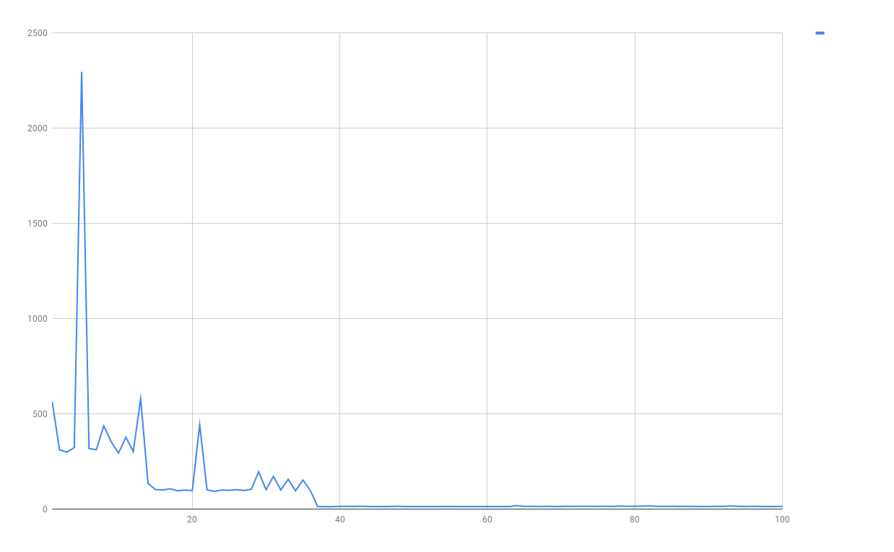
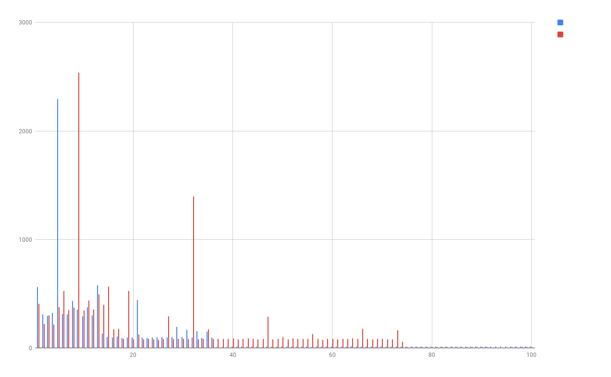

# 03 JIT

1. Compile and run `GCTest` class
2. Copy results to some spreadsheet file and visualize results on chart like one below:

3. Now compile, optimized with simple inlining version of code `Performance2`  and do the same.
4. Compare results.


# Exercise
1. Create new class called `AllocationPerformance.java` with following body:
```
public class AllocationPerformance {
    static final int CHUNK_SIZE = 1_000;

    public static void main(String[] args) {
        for (int i = 0; i < 500; i++) {
            long startTime = System.nanoTime();

            for (int j = 0; j < CHUNK_SIZE; j++) {
                new Object();
            }

            long endTime = System.nanoTime();
            System.out.printf("%d\t%d%n", i, endTime - startTime);
        }
    }
}
```
2. Compile, run class and  create chart as before.
3. Spot the lowest numbers? When do they drop?
4. Now try to make `CHUNK_SIZE` higher and update code to `10_000`
5. Compile and run again. Generate chart and compare. What did you notice?
Can you spot levels of code maturity?
How JIT optimized the code? 